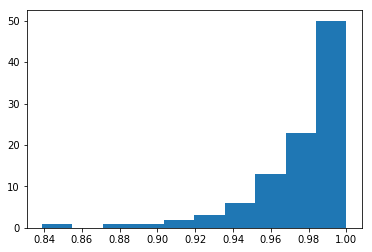
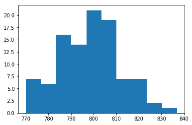
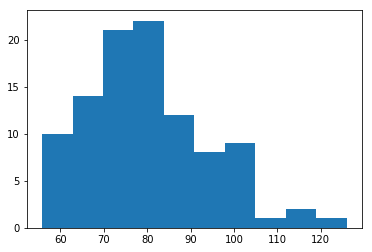
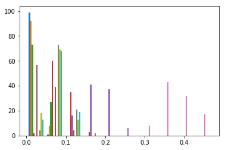
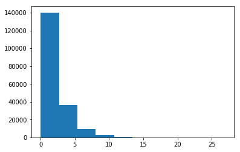
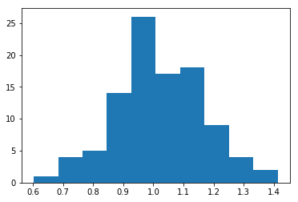
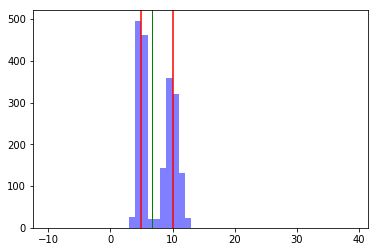
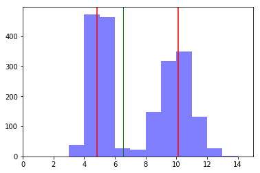

# Beta


```python
import numpy as np
import pandas as pd
import matplotlib.pyplot as plt
%matplotlib inline
```


```python
#beta(a, b[, size])
beta = np.random.beta(20, .5, 100)
plt.hist(beta)
plt.show()
print(np.mean(beta))
print(np.median(beta))
print(np.var(beta))
print(np.std(beta, ddof=1))


```





    0.9761683001223765
    0.9847314264520475
    0.0008305709686244016
    0.028964816145939584
    

This distribution seems very top heavy.  I see that most of the values congregate around 1, suggesting that the distribution is defined in terms of some metric (1).  When I look at Wikipedia, it seems that this distribution can describe the ability to learn how to reach a given metric.  This could be used to calculate/describe the rate towards success for a process (like A.I.)?

# binomial


```python
#binomial
binomial = np.random.binomial(1000, .8, 100)
plt.hist(binomial)
plt.show()
print(np.mean(binomial))
print(np.median(binomial))
print(np.var(binomial))
print(np.std(binomial, ddof=1))
```





    798.26
    798.5
    176.95239999999998
    13.369360417753647
    

This distribution seems regular.  It collects around the beta parameter.  When I change the alpha parameter the distribution seems to get more resolution.  When I look at wikipedia, it seems that fits, although when I look at size in python that seems like the same as what wiki says the alpha parameter should be.  So now I am confused.  I suppose I could think that the number of trials is the same as trying to figure out the causal powers of the parameter's significance.  And the actual sample size is trying to figure out how environmental parameters also influence the parameters... this is the same as Bayesian probability in that Bayes requires that one measure how ineffectual the model is.... or when environmental conditions trump the parameters of a model.

# Chi-square


```python
chisquare = np.random.chisquare(78, 100)
plt.hist(chisquare)
plt.show()
print(np.mean(chisquare))
print(np.median(chisquare))
print(np.var(chisquare))
print(np.std(chisquare, ddof=1))
```





    80.01416147561143
    78.53375542871828
    193.53674552556225
    13.981833289917047
    

I have no idea what to make of this.  Median and mean are close together, but the variation is high.  But in reading Wikipedia, it seems like this is a way to graph the effectiveness of statistically infered variables from experimentation.  In a way, it's a means of measuring models... but models which are created from observation... guessed models, I suppose.  It's a way of assessing how likely something is based on our empirical understanding of that something.  So not only do we need to doubt our empirical data, we also have to doubt how we construct how our empirical data interrelates.

From this we can use this doubt to calculate the likelihood that individual variables matter, given variation of other variables, and variations in the environment.

Actually now that I think about it, detective novels follow this... when a deep understanding of people or situations allows the detective to discover who was responsible for something... This is also why Lacan thought psychoanalysis was analogizable to a detective story; repetition of situations forces people to understand themselves when they are able to spot a feeling or a trend within themselves.  So through life we learn about ourselves and our assumptions that reality has to be a certain way... that lesson's effectiveness would be modeled by this distribution.

# Dirichlet


```python
dirichlet = np.random.dirichlet((2,3,5,12, 23, 6, 50, 10, 9, 10), 100)
plt.hist(dirichlet)
plt.show()
print(np.mean(dirichlet))
print(np.median(dirichlet))
print(np.var(dirichlet))
print(np.std(dirichlet, ddof=1))
```





    0.1
    0.06532714194242839
    0.011240031240630994
    0.10607206287781033
    

This looks like an overlay of 4 different sets or variables.  You could use this perhaps to assess the interrelation of these four possible results... They could be results, side-effects or independent variables.  They overlay over a distribution of 0 to 1 because we are measuring the veracity of possible causes in a situation that happens.  It's possible that the success of a situation could be independent of these variables.

Wikipedia seems to state something even deeper.  A Dirichlet distribution is a form of geometry that can point to an optimization of success given a normalized relation/ratio between all the givens in a situation.  If that is true then scientists would want to look for Dirichlets in data!

Then upon futher reading, of course in what is called the concentration parameter, one can use the geometric slope of the relative weights of the parameters to point to an optimal success, sort of bending in space to reach one.  This parameter seems to me to suggest a certain normalization of the parameters to the context.  This proves borne out because as I played with the array values of each of the givens, the number of parameters are always equivalent to the mean of the distribtion.  So, yes, regardless of the number of variables, they must have equal independence of the environment.  This equal independence is also a measure of any effective "missing" causes, because once all the true causes are found, the mean evens out to being completely effective.

This is the model of the kind of liberal super hero movies when all the missing heros are revealed.  And the lowliest of them is proven necessary to make the entire team work.  This is why killing the black guy is racist: because either he's not really important or he's not needed as a necessary force, because the heros could carry on without him in the eternal utopia.  This is what Black Panter does, when African-American heros are just needed to die, because the real heros is a pure race... the main branch of the family.

# Exponential


```python
exponential = np.random.exponential(2, 190000)
plt.hist(exponential)
plt.show()
print(np.mean(exponential))
print(np.median(exponential))
print(np.var(exponential))
print(np.std(exponential, ddof=1))
```





    2.007129821575919
    1.3912866709732452
    4.030004647521459
    2.0074924304175767
    

This is weird to me.  What does this measure?  It seems like it might measure the variance of results given an independence of variarous models.  But instead we get a change of scales.  The number of trials increasing seems to also slowly or exponentially increasing the x scale.  So this scale is really a measurement of the variance of the results given the regularity of various material models. 

Looking on Wikipedia, it appears that each collection of variables (or the number of them) follow the regular occurance of a model.  You could look at this as a collection of chemicals in a species, as the members change size.  Or you could be a detective and discover a rare occurance of a collection of bits that are not expected... which may show a branch in evolution or a new model of some sort, which is also able to be effective enough (like survive).  The number of their differences in dying would be the next layer of exponentiation, where you can try to find out the relative difference in chemical collections' strengths in lifespan.  A next depth would be to variate the environment, to show how different configurations ahve different local minimiums.  Ok, I get it.  Next!

# f


```python
f = np.random.f(152, 300, 100)
plt.hist(f)
plt.show()
print(np.mean(f))
print(np.median(f))
print(np.var(f))
print(np.std(f, ddof=1))
```





    1.0192097044628305
    1.0070298457717837
    0.021284419001964663
    0.1466267817736502
    

From the doc description, the intra-group variation of mutual out-groups makes sense.  Total sense, since each population would have an emotional configuration.  That configuration would find some mutual relationship relative to group but only because the base human model the groups are a collection of, would not variate.

Reading Wikipedia, of course it's more complex than that.  You can use this to measure our what groups are a collection of, relative to each other and relative to the collection's species "kind-"type is.  You can apply this test to brute force discovering what causes are "model significant".  We intuite a model, such like Asian or Frog, but to discover what they are you can feature model, or material model.

# Task 1

```python
beta = np.random.beta(20, .5, 1000)
plt.hist(beta)
plt.axvline(beta.mean(), color='b', linewidth=1)
plt.axvline(np.median(beta), color='g', linewidth=1)
plt.show()
```


Mean is a blue line. Median is a green line. Here the graph shows that the median value is as expected, expressed as the value where most of the values reside.  Mean is to the left of that, capturing the offset of the outliers to the left.  If I had to pick one line as capturing the most data, I would say that the mean does, as it seems to express 50% of the blue area for the left and the right.

A graph with standard deviations on mean:

```python
#adding lines:
plt.axvline(beta.mean() + np.std(beta, ddof=0), color = 'r')
plt.axvline(beta.mean() - np.std(beta, ddof=0), color = 'r')
```


Common characteristics of choosing a correct mean/standard deviation should determine what is an expected "normal" for a distribution that is, out of a random sample, what we would expect to be the value 68% of the time out of a hundred.  Such values within the red lines (standard devation within 1) should be centered on the selected average (mean or median) for each graph.  So if the graph has distributions that are shifted on one side, then standard deviation and mean should also be to that side.  if the graph has a valley (where values are split either side of a space) then standard devation and mean should be in the valley, with a tendacy to shift towards the side of the valley where more values reside.

# Task 2

```python
x = np.random.normal(10, 1, 1000)
y = np.random.normal(5, .5, 1000)
z = np.concatenate((x,y), axis=0)
#print(z)

plt.axvline(np.median(z), color='g', linewidth=1)
plt.hist(z, color='blue', bins=np.arange(-10, 40), alpha=.5) 
#plt.hist(y, color='red', bins=np.arange(-10, 40), alpha=.5)

plt.axvline(z.mean() + np.std(z, ddof=0), color = 'r')
plt.axvline(z.mean() - np.std(z, ddof=0), color = 'r')

plt.show()
```

What I expect to see, as there are two normal distributions is that there are two peaks, and one valley.  Because the two distributions are combined there should be a mean in the valley.  Given that one of the distributions has a tighter standard deviation, the mean should be closer spatially to that peak.



This graphs shows exactly what I have stated.  Since it hard to see, here is a close up of the interesting area.



Upon some further thought and observing the graph, it is also not surprising that the two standard deviations (above and below the mean) sit at what appears to be the mean of the original two distributions.  I hadn't thought of this correlation but that is exactly what has occured visually... This makes sense, since roughly 50% of each distribution would be included as roughly 50% above and below the mean of the new distribution. 
