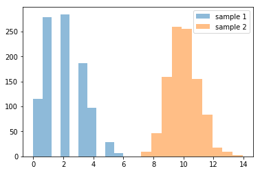

```python
import numpy as np
import pandas as pd
import scipy
import matplotlib.pyplot as plt
%matplotlib inline
```


```python
pop1 = np.random.binomial(10, 0.2, 10000)
pop2 = np.random.binomial(10, 0.5, 10000) 

# Let’s make histograms for the two groups. 

plt.hist(pop1, alpha=0.5, label='Population 1') 
plt.hist(pop2, alpha=0.5, label='Population 2') 
plt.legend(loc='upper right') 
plt.show()
```


```python
sample1 = np.random.choice(pop1, 100, replace=True)
sample2 = np.random.choice(pop2, 100, replace=True)

plt.hist(sample1, alpha=0.5, label='sample 1') 
plt.hist(sample2, alpha=0.5, label='sample 2') 
plt.legend(loc='upper right') 
plt.show()

print(sample1.mean())
print(sample2.mean())
print(sample1.std())
print(sample2.std())

# Compute the difference between the two sample means.
diff=sample2.mean( ) -sample1.mean()
print(diff)

from scipy.stats import ttest_ind
print(ttest_ind(sample2, sample1, equal_var=False))
```


    1.97
    2.043907706723969
    1.1528659939472583
    0.6568578965187346
    0.07390770672396907
    Ttest_indResult(statistic=0.554219274715044, pvalue=0.5802166124492804)
    

I would expect that the two means of the smaller sample would match the means of the same populations if the sample size were greater of each population -- limiting population variance so that the mean of the difference between the two .  If the smaller sample size, however, were smaller, the chances of total variance would be greater especially if the variance between each population were greater.

In other words, the variance of each population will impact the resolution of the variance of their differences if the sample size of the smaller population were too much smaller than a huge population.  As the smaller population and the larger population tend towards the same size, so the mean variance of their differences become more precise.  This precision could also be increased by lowering the difference of each member per population.  When a specices varies too much, or then getting the proper sample size is made more difficiult.

Answers:

1. Limiting sample or increasing original population is the same relationship since they influence the amount of variation within the union of both sample populations.  This interferes with accurately reflecting population difference.

2. Changing the variation of the individuals is the same as increasing the ratio of difference between the sample size and the general population.

3. I pick Gamma distribution for this example because it is next on the list.  I play with Gamma, write a few notes and then complete the assignment.  (See below for answer).


```python
#test for Gamma. .. 
pop2 = np.random.gamma(100, .1, 100000) 

plt.hist(pop2, alpha=0.5, label='Population 2') 
plt.legend(loc='upper right') 
plt.show()

print(np.mean(pop2))
print(np.median(pop2))
print(np.var(pop2))
print(np.std(pop2, ddof=1))

from scipy.stats import ttest_ind
print(ttest_ind(sample2, sample1, equal_var=False))
```


    9.997036743656809
    9.967162077522168
    1.0069067588925498
    1.0034524543100336
    Ttest_indResult(statistic=0.554219274715044, pvalue=0.5802166124492804)
    

This Gamma function seems to calibrate a standard divation with some noise about an established mean.  So the first two parameters are multipled together to get the mean  Basically, I think of the first number as the "base" mean for a standard divation curve.  From this, the second number examines the probability that this mean is achieved for a population -- essentially showing us the variance of a population.  

As I look on Wikipedia, it seems to confirm this, which makes sense in economics since this would represent quality control -- as the supply or production process variates, so will the target product also vary.  Measuring this value establishes a mean of probability and value... essentially the value of a product is its probable weight.  Some items produced might be darker, as with brands of coffee, or some number of chips may be defective -- due to a bad silicon source or due to cheap/loose manufacturing methods.

So what do I expect when I put these two together?

Since binomials also measure distributions of how unknown precision values can be captured, so they also match gamma.  In fact in python the two functions take the same type of variables... so it seems intuitively arguable that if the parameters match with a sufficiently large enough population than the noise would be eliminated as to what the relationship between the two populations were... essentially, the noise would cancel each other other.  But as the sample size shrinks so the noise will return.


```python
pop1 = np.random.binomial(10, 0.2, 10000)
pop2 = np.random.gamma(10, 0.2, 10000) 

# Let’s make histograms for the two groups. 

plt.hist(pop1, alpha=0.5, label='Population 1') 
plt.hist(pop2, alpha=0.5, label='Population 2') 
plt.legend(loc='upper right') 
plt.show()
```


```python
sample1 = np.random.choice(pop1, 1000, replace=True)
sample2 = np.random.choice(pop2, 1000, replace=True)

plt.hist(sample1, alpha=0.5, label='sample 1') 
plt.hist(sample2, alpha=0.5, label='sample 2') 
plt.legend(loc='upper right') 
plt.show()

print(sample1.mean())
print(sample2.mean())
print(sample1.std())
print(sample2.std())

# Compute the difference between the two sample means.
diff=sample2.mean( ) -sample1.mean()
print(diff)

from scipy.stats import ttest_ind
print(ttest_ind(sample2, sample1, equal_var=False))
```





    1.985
    10.005497432313284
    1.3002980427578903
    1.0066639511234623
    8.020497432313284
    Ttest_indResult(statistic=154.15899664334103, pvalue=0.0)
    

Answer 3: This seems in fact true... in that matching the variables with limiting noise makes irrelevant these two distribution's differences (p-value tends towards zero), probably since both are distributions based off of the standard deviation.

The moral seems to be that smaller sample sizes are more error prone, essentially introducing more noise into the sample, compounding any noise as variation already within the normal population.  Thus the Central Limit Theorem seems to be that large enough samples eliminate noise, since noise regularizes out as actually independent of the model that is being captured.  More data can be used to refine the model or greater refined model can be used to predict more refined data.  Interesting!

# Task 1 & 2

```python
pop1 = np.random.binomial(10, 0.2, 1000)
pop2 = np.random.binomial(10, 0.5, 1000) 

plt.hist(pop1, alpha=0.5, label='Population 1') 
plt.hist(pop2, alpha=0.5, label='Population 2') 
plt.axvline(pop1.mean(), color = 'r')
plt.axvline(pop1.mean() + np.std(pop1, ddof=0), color = 'b')
plt.axvline(pop1.mean() - np.std(pop1, ddof=0), color = 'b')
plt.axvline(pop2.mean(), color = 'r')
plt.axvline(pop2.mean() + np.std(pop2, ddof=0), color = 'g')
plt.axvline(pop2.mean() - np.std(pop2, ddof=0), color = 'g')
plt.legend(loc='upper right') 
plt.show()

print("pop1 " + str(pop1.mean()) + " " + str(np.std(pop1, ddof = 0))) 
print("pop2 " + str(pop2.mean()) + " " + str(np.std(pop2, ddof = 0)))
```

Chart at 1000


pop1 1.955 1.296524199542762
pop2 4.981 1.6145089036608005

Chart at 20


pop1 2.0 1.0954451150103321
pop2 5.1 1.8681541692269406

Between populations of 1000 and 20 we see that the mean is more accurate with a smaller variation but that with larger populations, there is less variance.  I suppose this is the case because as these functions are mathematically generated from the same process, the smaller population acts as a more "random" sample of instances of generation.  I would assume that as the population gets increasingly larger, the mean and standard deviation would approach more exact values.  I would assume that the p value as between between 0 and 1 is the percentage of success, so as the p value is greater, so the standard deviation would increase as you get more chances of success.  You see that in the chart, as the green lines marking the borders of pop2 cover a larger area than pop1.

# Task 3 


pop1 2.928 1.4278711426455821
pop2 5.018 1.59489059185889

Ttest_indResult(statistic=-29.903437818255984, pvalue=2.0214026322742818e-162)

# Task 4


pop1 3.965 1.5381076035180374
pop2 5.061 1.5922559467623287

Ttest_indResult(statistic=-14.166219016717703, pvalue=1.7538001608752173e-43)

With a closer p value between pop1 and pop2 there is more overlap, so we see that statistic is converging.  The p value however seems to change significantly each time I run that block in python.
